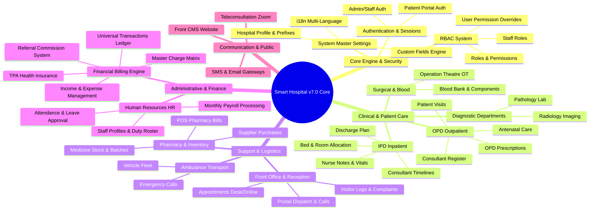
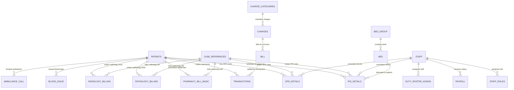
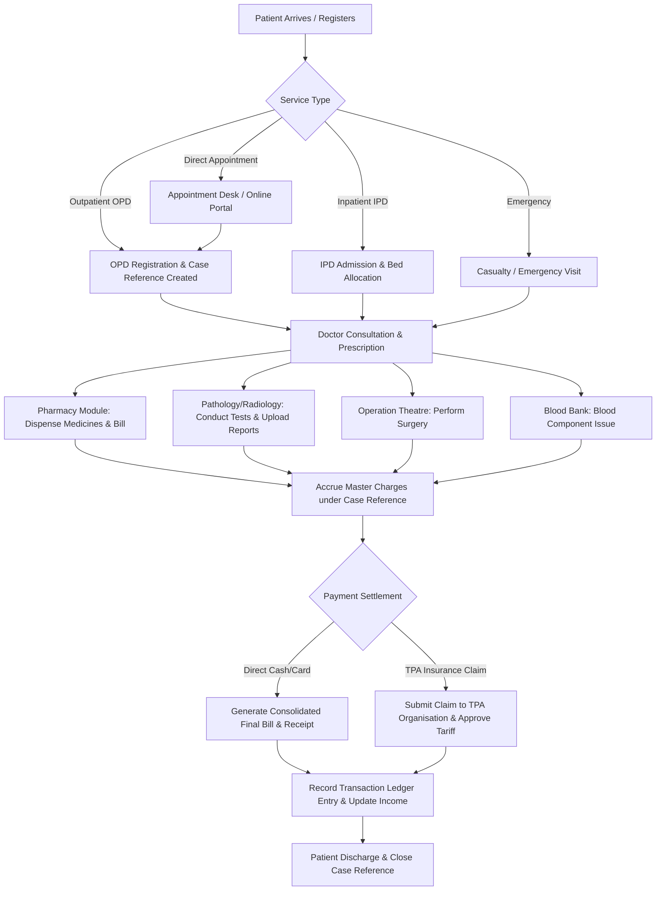

# 🏥 Smart Hospital v7.0 Complete Architectural Mind Map & Codebase Analysis
> **System Overview**: PHP CodeIgniter 3 Enterprise Hospital Management System (HMS) with 178 Database Tables, 201 Controllers, 128 Data Models, 844 Views, and Multi-Role Access Control.

## 📑 Table of Contents
1. [System Architecture & Visual High-Level Mind Map](#1-system-architecture--visual-high-level-mind-map)
2. [Detailed Module Breakdown (UI, Controllers, Models & Workflows)](#2-detailed-module-breakdown-ui-controllers-models--workflows)
3. [Database Table Schema & Data Structures (All 178 Tables)](#3-database-table-schema--data-structures-all-178-tables)
4. [Entity Relationship Map & Foreign Key Links](#4-entity-relationship-map--foreign-key-links)
5. [Cross-Module Dependencies & Unified Clinical/Financial Pipelines](#5-cross-module-dependencies--unified-clinicalfinancial-pipelines)
6. [Deep Technical Concepts & Architectural Patterns](#6-deep-technical-concepts--architectural-patterns)

---

## 1. System Architecture & Visual High-Level Mind Map
Smart Hospital v7.0 follows an enterprise-grade **CodeIgniter 3 MVC (Model-View-Controller)** modular monolith pattern. The system is designed around a central patient repository (`patients`), a unified staff directory (`staff`), a case tracking engine (`case_references`), and a universal billing ledger (`transactions` & `charges`).

### 🧠 High-Level System Mind Map (Mermaid Concept Tree)


## 2. Detailed Module Breakdown (UI, Controllers, Models & Workflows)
Below is the deep analysis of each of the 18 architectural modules in Smart Hospital v7.0, mapping its UI views, Controllers, Data Models, User Roles, and Business Workflows.

### 🔹 Module: Core Authentication & RBAC
- **Primary User Persona**: `Super Admin, System Administrator, All Users`
- **Functional Description**: Manages fine-grained role-based access control (RBAC), user authentication, permission groups, staff roles, and patient portal user accounts.
- **Key Controllers**: `admin/Roles.php`, `admin/Admin.php`, `Site.php`, `Welcome.php`
- **Primary Views**: `admin/roles/index.php`, `admin/roles/addpermission.php`, `site/login.php`, `user/login.php`
- **Core Models**: `Role_model.php`, `Rolepermission_model.php`, `Userpermission_model.php`, `Staffroles_model.php`, `User_model.php`
- **Associated Tables (9)**: `chat_users`, `permission_category`, `permission_group`, `permission_patient`, `roles`, `roles_permissions`, `staff_roles`, `users`, `users_authentication`
- **Core Workflow**: *Admin defines roles -> Assigns module permissions (View, Add, Edit, Delete) -> Assigns roles to staff -> System verifies `$this->rbac->hasPerm()` on every controller endpoint.*

### 🔹 Module: Patient Management (OPD, IPD, Casualty)
- **Primary User Persona**: `Doctors, Nurses, Receptionists, OPD/IPD Managers`
- **Functional Description**: Central clinical engine managing Outpatient (OPD) visits, Inpatient (IPD) admissions, Emergency/Casualty, Doctor Shift Times, Vital Signs, Nurse Notes, Antenatal examinations, Case References, and Patient Discharges.
- **Key Controllers**: `admin/Patient.php`, `admin/Antenatal.php`, `admin/Prescription.php`, `admin/Timeline.php`, `admin/Vital.php`, `patient/Dashboard.php`
- **Primary Views**: `admin/patient/search.php`, `admin/patient/profile.php`, `admin/patient/opdreport.php`, `admin/patient/ipdreport.php`, `admin/patient/antenatalfinding.php`
- **Core Models**: `Patient_model.php`, `Antenatal_model.php`, `Prescription_model.php`, `Casereference_model.php`, `Vital_model.php`, `Timeline_model.php`
- **Associated Tables (21)**: `antenatal_examine`, `case_references`, `doctor_shift_time`, `finding_category`, `ipd_details`, `ipd_doctors`, `ipd_prescription_basic`, `ipd_prescription_details`, `ipd_prescription_test`, `nurse_note`, `nurse_notes_comment`, `opd_details`, `patient_bed_history`, `patient_charges`, `patient_id_card`, `patient_timeline`, `patients`, `patients_vitals`, `symptoms`, `symptoms_classification`, `vitals`
- **Core Workflow**: *Patient Registration -> Create OPD/IPD Visit -> Generate Case Reference ID -> Doctor Consultation & Vitals Entry -> Clinical Notes & Prescriptions -> Nurse Bed Care -> Discharge Summary & Final Billing.*

### 🔹 Module: Pharmacy & Medicine
- **Primary User Persona**: `Pharmacist, Pharmacy Store Keeper, Accountant`
- **Functional Description**: Manages medicine categories, medicine masters, dosage, batch numbers, expiry dates, supplier purchase orders, medicine stock inventory, and POS Pharmacy Sales Billing.
- **Key Controllers**: `admin/Pharmacy.php`, `admin/Medicinecategory.php`, `admin/Medicinedosage.php`, `admin/Medicineunit.php`, `admin/Expmedicine.php`
- **Primary Views**: `admin/pharmacy/search.php`, `admin/pharmacy/pharmacyBill.php`, `admin/pharmacy/import.php`, `admin/pharmacy/medicineDetail.php`
- **Core Models**: `Pharmacy_model.php`, `Medicine_category_model.php`, `Medicine_dosage_model.php`, `Expmedicine_model.php`
- **Associated Tables (13)**: `item_supplier`, `medicine_batch_details`, `medicine_category`, `medicine_dosage`, `medicine_group`, `medicine_supplier`, `organisations_medicine_charges`, `orgnization_medicine_charge`, `pharmacy`, `pharmacy_bill_basic`, `pharmacy_bill_detail`, `pharmacy_company`, `supplier_bill_basic`
- **Core Workflow**: *Add Medicine Master -> Purchase Stock from Supplier -> Batch & Expiry Entry -> Patient Medicine Request (OPD/IPD/Direct) -> POS Pharmacy Bill Generation -> Automated Inventory Stock Deduction.*

### 🔹 Module: Pathology & Laboratory
- **Primary User Persona**: `Pathologist, Lab Technician, Medical Officer`
- **Functional Description**: Handles pathological test masters, test categories, diagnostic parameters, test result entry, report generation, pathology billing, and lab result printouts.
- **Key Controllers**: `admin/Pathology.php`, `admin/Pathologycategory.php`, `admin/Lab.php`
- **Primary Views**: `admin/pathology/search.php`, `admin/pathology/pathologyReport.php`, `admin/pathology/printReport.php`, `admin/pathology/parameter.php`
- **Core Models**: `Pathology_model.php`, `Pathology_category_model.php`, `Lab_model.php`
- **Associated Tables (6)**: `pathology_billing`, `pathology_category`, `pathology_parameter`, `pathology_parameterdetails`, `pathology_report`, `pathology_report_parameterdetails`
- **Core Workflow**: *Create Pathology Test with Parameters -> Order Pathology Test for Patient -> Generate Pathology Bill -> Sample Collection & Lab Test Execution -> Enter Result Values -> Pathologist Approval -> Print/Share Lab Report.*

### 🔹 Module: Radiology & Imaging
- **Primary User Persona**: `Radiologist, X-Ray/MRI/CT Technician`
- **Functional Description**: Manages radiology test categories, imaging test masters, parameter details, radiology report generation, image attachments, and radiology billing.
- **Key Controllers**: `admin/Radio.php`
- **Primary Views**: `admin/radio/search.php`, `admin/radio/radiologyReport.php`, `admin/radio/printReport.php`
- **Core Models**: `Radio_model.php`
- **Associated Tables (6)**: `radio`, `radiology_billing`, `radiology_parameter`, `radiology_parameterdetails`, `radiology_report`, `radiology_report_parameterdetails`
- **Core Workflow**: *Configure Radiology Test -> Request Radiology Test -> Generate Radiology Bill -> Perform Imaging (X-Ray/CT/MRI) -> Upload Image & Report -> Radiologist Sign-off.*

### 🔹 Module: Operation Theatre (OT)
- **Primary User Persona**: `Surgeon, Anesthetist, OT Nurse, OT Manager`
- **Functional Description**: Manages operation categories, surgical procedures, OT room bookings, surgical team assignment (Surgeon, Anesthetist, Assistants), OT notes, and Operation Theatre billing.
- **Key Controllers**: `admin/Operationtheatre.php`
- **Primary Views**: `admin/operationtheatre/otdetails.php`, `admin/operationtheatre/otreport.php`
- **Core Models**: `Operationtheatre_model.php`
- **Associated Tables (3)**: `operation`, `operation_category`, `operation_theatre`
- **Core Workflow**: *Schedule Operation -> Assign Surgery Team (Surgeon, Anesthetist, Nurse) -> Allocate OT Room -> Perform Surgery & Record OT Notes -> Calculate OT Charges & Add to Patient Bill.*

### 🔹 Module: Blood Bank
- **Primary User Persona**: `Blood Bank Manager, Lab Technician, Donor Coordinator`
- **Functional Description**: Manages blood donors, donor donation cycles, blood group inventory bags, blood components (Plasma, Platelets, RBC), blood bag issues, and Blood Bank billing.
- **Key Controllers**: `admin/Bloodbank.php`, `admin/Bloodbankstatus.php`
- **Primary Views**: `admin/bloodbank/blooddonor.php`, `admin/bloodbank/bloodissue.php`, `admin/bloodbank/products.php`
- **Core Models**: `Blooddonor_model.php`, `Blood_donorcycle_model.php`, `Bloodissue_model.php`, `Bloodbankstatus_model.php`
- **Associated Tables (4)**: `blood_bank_products`, `blood_donor`, `blood_donor_cycle`, `blood_issue`
- **Core Workflow**: *Register Blood Donor -> Conduct Donation Cycle & Test Blood -> Store Blood Bags & Components in Inventory -> Process Blood Issue Request for Patient -> Generate Blood Issue Bill.*

### 🔹 Module: Ambulance & Vehicle Transport
- **Primary User Persona**: `Ambulance Driver, Transport Coordinator, Receptionist`
- **Functional Description**: Manages hospital vehicle fleet, vehicle registration, driver allocation, ambulance emergency call booking, distance/charge tracking, and transport billing.
- **Key Controllers**: `admin/Vehicle.php`
- **Primary Views**: `admin/vehicle/search.php`, `admin/vehicle/ambulance_call.php`
- **Core Models**: `Vehicle_model.php`, `Ambulance_model.php`
- **Associated Tables (1)**: `ambulance_call`
- **Core Workflow**: *Register Vehicle & Driver -> Receive Ambulance Request -> Dispatch Ambulance -> Record Trip Distance & Driver -> Generate Ambulance Call Bill.*

### 🔹 Module: Human Resources & Payroll
- **Primary User Persona**: `HR Manager, Super Admin, Accountant`
- **Functional Description**: Comprehensive HR system managing staff profiles, departments, designations, duty roster shifts & assignments, staff attendance (manual/biometric), leave requests, and monthly payroll calculation (basic pay, allowances, deductions, payslips).
- **Key Controllers**: `admin/Staff.php`, `admin/Department.php`, `admin/Designation.php`, `admin/Dutyroster.php`, `admin/Staffattendance.php`, `admin/Leaverequest.php`, `admin/Payroll.php`
- **Primary Views**: `admin/staff/staffprofile.php`, `admin/staff/payroll.php`, `admin/dutyroster/index.php`, `admin/staffattendance/index.php`
- **Core Models**: `Staff_model.php`, `Department_model.php`, `Designation_model.php`, `Dutyroster_model.php`, `Staffattendancemodel.php`, `Leaverequest_model.php`, `Payroll_model.php`
- **Associated Tables (16)**: `conference_staff`, `department`, `duty_roster_assign`, `duty_roster_list`, `duty_roster_shift`, `leave_types`, `staff`, `staff_attendance`, `staff_attendance_type`, `staff_attendence_schedules`, `staff_designation`, `staff_id_card`, `staff_leave_details`, `staff_leave_request`, `staff_payroll`, `staff_timeline`
- **Core Workflow**: *Hire Staff & Create Profile -> Assign Department, Designation & Roster Shift -> Record Daily Attendance -> Process Leave Requests -> Generate Monthly Payroll & Payslip.*

### 🔹 Module: Financial Management (Billing, Charges, Income, Expense, TPA, Referral)
- **Primary User Persona**: `Accountant, Finance Manager, Billing Clerk, Super Admin`
- **Functional Description**: The central financial nerve system of the hospital. Handles Master Charge Matrix (OPD, IPD, Procedures, OT, Lab, Blood, Transport), TPA Health Insurance Management, Referral Person Commission Tracking, Income Heads, Expense Heads, Multi-Module Bill Settlement, and Unified Payment Transactions.
- **Key Controllers**: `admin/Bill.php`, `admin/Charges.php`, `admin/Chargecategory.php`, `admin/Income.php`, `admin/Expense.php`, `admin/Tpa.php`, `admin/Referral.php`, `admin/Transaction.php`
- **Primary Views**: `admin/bill/index.php`, `admin/charges/index.php`, `admin/income/index.php`, `admin/expense/index.php`, `admin/tpa/index.php`, `admin/referral/index.php`
- **Core Models**: `Bill_model.php`, `Charge_model.php`, `Charge_category_model.php`, `Income_model.php`, `Expense_model.php`, `Tpa_model.php`, `Referral_commission_model.php`, `Transaction_model.php`
- **Associated Tables (24)**: `appointment_payment`, `bill`, `charge_categories`, `charge_type_master`, `charge_type_module`, `charge_units`, `charges`, `custom_fields`, `discharge_card`, `expense_head`, `expenses`, `income`, `income_head`, `organisations_charges`, `payment_settings`, `referral_category`, `referral_commission`, `referral_payment`, `referral_person`, `referral_person_commission`, `referral_type`, `tax_category`, `transactions`, `transactions_processing`
- **Core Workflow**: *Define Master Charges & TPA Tariffs -> Services Rendered across Clinical Modules -> Accrue Charges on Patient Case -> Calculate Referral Commission -> Collect Payment (Cash/Card/Online/TPA Claim) -> Record Transaction Entry.*

### 🔹 Module: Front Office & Reception
- **Primary User Persona**: `Receptionist, Front Desk Officer`
- **Functional Description**: Handles front desk operations: visitor logs, phone call logs, postal dispatch and receive records, patient complaints, and source tracking.
- **Key Controllers**: `admin/Visitors.php`, `admin/Generalcall.php`, `admin/Dispatch.php`, `admin/Receive.php`, `admin/Complaint.php`
- **Primary Views**: `admin/visitors/index.php`, `admin/generalcall/index.php`, `admin/dispatch/index.php`, `admin/complaint/index.php`
- **Core Models**: `Visitors_model.php`, `General_call_model.php`, `Dispatch_model.php`, `Complaint_model.php`
- **Associated Tables (5)**: `complaint`, `complaint_type`, `source`, `visitors_book`, `visitors_purpose`
- **Core Workflow**: *Log Visitor arrival / Log Phone Call -> Process Postal Packet -> Register Patient Complaint -> Assign Complaint Resolution Officer -> Follow-up & Close.*

### 🔹 Module: Appointments & Scheduling
- **Primary User Persona**: `Receptionist, Doctor, Patient`
- **Functional Description**: Manages doctor appointment priorities, doctor shift slots, appointment booking via front desk or online patient portal, appointment status tracking (Approved, Pending, Cancelled), and appointment payments.
- **Key Controllers**: `admin/Appointment.php`, `admin/Onlineappointment.php`, `admin/Appointpriority.php`
- **Primary Views**: `admin/appointment/index.php`, `admin/appointment/onlineappointment.php`
- **Core Models**: `Appointment_model.php`, `Onlineappointment_model.php`, `Appoint_priority_model.php`
- **Associated Tables (2)**: `appoint_priority`, `appointment`
- **Core Workflow**: *Doctor defines Shift Timings & Slots -> Patient/Receptionist selects Doctor & Slot -> Pay Appointment Fee -> Appointment Confirmed -> Patient arrives for OPD Visit.*

### 🔹 Module: Certificates & ID Cards
- **Primary User Persona**: `HR Officer, Administrative Officer`
- **Functional Description**: Provides customizable template builders and batch generation tools for Patient ID Cards, Staff ID Cards, Birth Certificates, Death Certificates, and Transfer/Medical Certificates.
- **Key Controllers**: `admin/Certificate.php`, `admin/Generatecertificate.php`, `admin/Generatepatientidcard.php`, `admin/Generatestaffidcard.php`, `admin/Birthordeath.php`
- **Primary Views**: `admin/certificate/index.php`, `admin/generatecertificate/index.php`, `admin/birthordeath/index.php`
- **Core Models**: `Certificate_model.php`, `Patient_id_card_model.php`, `Staffidcard_model.php`, `Birthordeath_model.php`
- **Associated Tables (1)**: `certificates`
- **Core Workflow**: *Design ID Card / Certificate Template with Placeholders -> Select Target Patients or Staff -> Click Generate -> System merges dynamic fields and renders printable PDF/HTML.*

### 🔹 Module: Messaging, Email & Notifications
- **Primary User Persona**: `System Admin, All Staff, Patients`
- **Functional Description**: Multi-channel messaging platform supporting internal live chat between staff members, automated SMS notifications, SMTP Email alerts, bulk announcements, and event-driven system notifications (e.g. Bill Generated, Appointment Booked).
- **Key Controllers**: `admin/Chat.php`, `admin/Mailsms.php`, `admin/Bulkmessage.php`, `admin/Notification.php`, `Emailconfig.php`, `Smsconfig.php`
- **Primary Views**: `admin/chat/index.php`, `admin/mailsms/index.php`, `admin/notification/index.php`
- **Core Models**: `Chatuser_model.php`, `Messages_model.php`, `Notification_model.php`, `Notificationsetting_model.php`, `Emailconfig_model.php`, `Smsconfig_model.php`
- **Associated Tables (11)**: `chat_connections`, `chat_messages`, `email_config`, `messages`, `notification_setting`, `read_notification`, `read_systemnotification`, `send_notification`, `sms_config`, `system_notification`, `system_notification_setting`
- **Core Workflow**: *Trigger Event (e.g., Patient OPD Admission) -> Check Notification Settings -> Construct Template with dynamic tokens -> Send instant SMS/Email & Internal Push Notification.*

### 🔹 Module: Teleconsultation & Zoom
- **Primary User Persona**: `Doctors, Patients, Telemedicine Coordinators`
- **Functional Description**: Integrates Zoom API for online video consultations between doctors and patients, as well as virtual staff meetings and medical conferences.
- **Key Controllers**: `admin/Zoom_conference.php`
- **Primary Views**: `admin/zoom_conference/index.php`, `admin/zoom_conference/consult.php`
- **Core Models**: `Conference_model.php`, `Conferencehistory_model.php`
- **Associated Tables (3)**: `conferences`, `conferences_history`, `zoom_settings`
- **Core Workflow**: *Doctor schedules Zoom Teleconsultation -> System creates Zoom Meeting via API -> Shares URL with Patient -> Meeting occurs online -> Host completes meeting and logs duration.*

### 🔹 Module: Front CMS (Website Content Management)
- **Primary User Persona**: `Web Master, Public Relations Officer`
- **Functional Description**: Built-in Content Management System (CMS) powering the hospital's public-facing portal: custom web pages, navigation menus, news events, image/video media gallery, and dynamic contact forms.
- **Key Controllers**: `admin/Frontcms.php`, `admin/Content.php`
- **Primary Views**: `admin/frontcms/index.php`, `admin/content/index.php`
- **Core Models**: `Frontcms_setting_model.php`, `Cms_page_model.php`, `Cms_menu_model.php`, `Cms_media_model.php`
- **Associated Tables (8)**: `events`, `front_cms_media_gallery`, `front_cms_menu_items`, `front_cms_menus`, `front_cms_page_contents`, `front_cms_program_photos`, `front_cms_programs`, `front_cms_settings`
- **Core Workflow**: *Upload Media Files -> Draft Web Page with Layout Widgets -> Add Page to Main Navigation Menu -> Publish to Public Website.*

### 🔹 Module: System Settings & Configuration
- **Primary User Persona**: `Super Admin`
- **Functional Description**: Master configuration dashboard for hospital name, logo, currency, invoice auto-numbering prefixes, custom field definition across modules, print header/footer templates, QR code setup, and multi-language translation (i18n).
- **Key Controllers**: `Schsettings.php`, `admin/Prefix.php`, `admin/Printing.php`, `admin/Customfield.php`, `admin/Language.php`, `admin/Paymentsettings.php`
- **Primary Views**: `admin/schsettings/index.php`, `admin/prefix/index.php`, `admin/customfield/index.php`, `admin/language/index.php`
- **Core Models**: `Setting_model.php`, `Prefix_model.php`, `Printing_model.php`, `Customfield_model.php`, `Language_model.php`, `Paymentsetting_model.php`
- **Associated Tables (5)**: `QR_code_settings`, `languages`, `prefixes`, `print_setting`, `sch_settings`
- **Core Workflow**: *Admin configures Hospital Parameters -> Dynamic Form Fields created via Custom Fields Engine -> System formatting, print headers, and auto-generated serial prefixes applied globally.*

### 🔹 Module: Audit, Logs & System Maintenance
- **Primary User Persona**: `Super Admin, Auditor`
- **Functional Description**: System maintenance suite providing user activity login logs, action audit trails, database backup and SQL restore tools, cron job automation, and version updater.
- **Key Controllers**: `admin/Audit.php`, `admin/Userlog.php`, `admin/Backup.php`, `admin/Updater.php`, `Cron.php`
- **Primary Views**: `admin/audit/index.php`, `admin/userlog/index.php`, `admin/backup/backup.php`
- **Core Models**: `Audit_model.php`, `Userlog_model.php`
- **Associated Tables (40)**: `addon_versions`, `annual_calendar`, `bed_group`, `bed_type`, `captcha`, `contents`, `death_report`, `doctor_absent`, `dose_duration`, `dose_interval`, `filetypes`, `floor`, `gateway_ins`, `gateway_ins_response`, `global_shift`, `google_authenticator`, `item`, `item_category`, `item_issue`, `item_stock`, `item_store`, `lab`, `logs`, `medication_report`, `migrations`, `obstetric_history`, `organisation`, `payslip_allowance`, `postnatal_examine`, `primary_examine`, `share_content_for`, `share_contents`, `share_upload_contents`, `shift_details`, `specialist`, `unit`, `upload_contents`, `user_google_authenticate_codes`, `userlog`, `visit_details`
- **Core Workflow**: *User performs sensitive operation (e.g. Delete Bill/Edit Patient) -> Audit Hook intercepts event -> Writes user IP, timestamp, action detail to `audit` table -> Available for compliance report.*

## 3. Database Table Schema & Data Structures (All 178 Tables)
The Smart Hospital v7.0 MySQL database consists of **178 relational tables**. Below is the grouped structural catalog listing all tables, primary keys, and core column definitions.

### 📂 Domain: Core Authentication & RBAC (9 Tables)
| Table Name | Primary Key | Total Columns | Core Columns Summary |
| :--- | :--- | :--- | :--- |
| `chat_users` | `id` | `9` | `id, user_type, staff_id, patient_id, create_staff_id, create_patient_id, ... (+3 more)` |
| `permission_category` | `id` | `9` | `id, perm_group_id, name, short_code, enable_view, enable_add, ... (+3 more)` |
| `permission_group` | `id` | `7` | `id, name, short_code, is_active, system, sort_order, ... (+1 more)` |
| `permission_patient` | `id` | `8` | `id, permission_group_short_code, name, short_code, is_active, system, ... (+2 more)` |
| `roles` | `id` | `7` | `id, name, slug, is_active, is_system, is_superadmin, ... (+1 more)` |
| `roles_permissions` | `id` | `8` | `id, role_id, perm_cat_id, can_view, can_add, can_edit, ... (+2 more)` |
| `staff_roles` | `id` | `5` | `id, role_id, staff_id, is_active, created_at` |
| `users` | `id` | `9` | `id, user_id, username, password, childs, role, ... (+3 more)` |
| `users_authentication` | `id` | `16` | `id, users_id, token, expired_at, created_at, updated_at, ... (+10 more)` |


### 📂 Domain: Patient Management (OPD, IPD, Casualty) (21 Tables)
| Table Name | Primary Key | Total Columns | Core Columns Summary |
| :--- | :--- | :--- | :--- |
| `antenatal_examine` | `id` | `17` | `id, primary_examine_id, visit_details_id, ipdid, uter_size, uterus_size, ... (+11 more)` |
| `case_references` | `id` | `4` | `id, bill_id, discount_percentage, created_at` |
| `doctor_shift_time` | `id` | `7` | `id, day, staff_id, doctor_global_shift_id, start_time, end_time, ... (+1 more)` |
| `finding_category` | `id` | `3` | `id, category, created_at` |
| `ipd_details` | `id` | `28` | `id, patient_id, case_reference_id, height, weight, pulse, ... (+22 more)` |
| `ipd_doctors` | `id` | `4` | `id, ipd_id, consult_doctor, created_at` |
| `ipd_prescription_basic` | `id` | `13` | `id, ipd_id, visit_details_id, attachment, attachment_name, header_note, ... (+7 more)` |
| `ipd_prescription_details` | `id` | `8` | `id, basic_id, pharmacy_id, dosage, dose_interval_id, dose_duration_id, ... (+2 more)` |
| `ipd_prescription_test` | `id` | `5` | `id, ipd_prescription_basic_id, pathology_id, radiology_id, created_at` |
| `nurse_note` | `id` | `9` | `id, date, ipd_id, staff_id, note, comment, ... (+3 more)` |
| `nurse_notes_comment` | `id` | `5` | `id, nurse_note_id, comment_staffid, comment_staff, created_at` |
| `opd_details` | `id` | `7` | `id, case_reference_id, patient_id, generated_by, is_ipd_moved, discharged, ... (+1 more)` |
| `patient_bed_history` | `id` | `9` | `id, case_reference_id, bed_group_id, bed_id, revert_reason, from_date, ... (+3 more)` |
| `patient_charges` | `id` | `17` | `id, date, ipd_id, opd_id, qty, charge_id, ... (+11 more)` |
| `patient_id_card` | `id` | `18` | `id, title, hospital_name, hospital_address, background, logo, ... (+12 more)` |
| `patient_timeline` | `id` | `11` | `id, patient_id, title, timeline_date, description, document, ... (+5 more)` |
| `patients` | `id` | `32` | `id, lang_id, patient_name, dob, age, month, ... (+26 more)` |
| `patients_vitals` | `id` | `6` | `id, patient_id, vital_id, reference_range, messure_date, created_at` |
| `symptoms` | `id` | `5` | `id, symptoms_title, description, type, created_at` |
| `symptoms_classification` | `id` | `3` | `id, symptoms_type, created_at` |
| `vitals` | `id` | `6` | `id, name, reference_range, unit, is_system, created_at` |


### 📂 Domain: Pharmacy & Medicine (13 Tables)
| Table Name | Primary Key | Total Columns | Core Columns Summary |
| :--- | :--- | :--- | :--- |
| `item_supplier` | `id` | `10` | `id, item_supplier, phone, email, address, contact_person_name, ... (+4 more)` |
| `medicine_batch_details` | `id` | `17` | `id, supplier_bill_basic_id, pharmacy_id, inward_date, expiry, batch_no, ... (+11 more)` |
| `medicine_category` | `id` | `3` | `id, medicine_category, created_at` |
| `medicine_dosage` | `id` | `5` | `id, medicine_category_id, dosage, units_id, created_at` |
| `medicine_group` | `id` | `3` | `id, group_name, created_at` |
| `medicine_supplier` | `id` | `8` | `id, supplier, contact, supplier_person, supplier_person_contact, supplier_drug_licence, ... (+2 more)` |
| `organisations_medicine_charges` | `id` | `5` | `id, medicine_batch_details_id, org_id, org_charge, created_at` |
| `orgnization_medicine_charge` | `id` | `16` | `id, org_id, batch_id, org_charge, created_at, id, ... (+10 more)` |
| `pharmacy` | `id` | `17` | `id, medicine_name, medicine_category_id, medicine_image, medicine_company, medicine_composition, ... (+11 more)` |
| `pharmacy_bill_basic` | `id` | `21` | `id, date, patient_id, ipd_prescription_basic_id, case_reference_id, customer_name, ... (+15 more)` |
| `pharmacy_bill_detail` | `id` | `8` | `id, pharmacy_bill_basic_id, medicine_batch_detail_id, quantity, sale_price, discount, ... (+2 more)` |
| `pharmacy_company` | `id` | `3` | `id, company_name, created_at` |
| `supplier_bill_basic` | `id` | `19` | `id, invoice_no, date, supplier_id, file, total, ... (+13 more)` |


### 📂 Domain: Pathology & Laboratory (6 Tables)
| Table Name | Primary Key | Total Columns | Core Columns Summary |
| :--- | :--- | :--- | :--- |
| `pathology_billing` | `id` | `21` | `id, case_reference_id, ipd_prescription_basic_id, date, patient_id, doctor_id, ... (+15 more)` |
| `pathology_category` | `id` | `3` | `id, category_name, created_at` |
| `pathology_parameter` | `id` | `10` | `id, parameter_name, test_value, reference_range, range_from, range_to, ... (+4 more)` |
| `pathology_parameterdetails` | `id` | `4` | `id, pathology_id, pathology_parameter_id, created_id` |
| `pathology_report` | `id` | `19` | `id, pathology_bill_id, pathology_id, customer_type, patient_id, reporting_date, ... (+13 more)` |
| `pathology_report_parameterdetails` | `id` | `5` | `id, pathology_report_id, pathology_parameterdetail_id, pathology_report_value, created_at` |


### 📂 Domain: Radiology & Imaging (6 Tables)
| Table Name | Primary Key | Total Columns | Core Columns Summary |
| :--- | :--- | :--- | :--- |
| `radio` | `id` | `9` | `id, test_name, short_name, test_type, radiology_category_id, sub_category, ... (+3 more)` |
| `radiology_billing` | `id` | `21` | `id, patient_id, case_reference_id, ipd_prescription_basic_id, doctor_id, date, ... (+15 more)` |
| `radiology_parameter` | `id` | `10` | `id, parameter_name, test_value, reference_range, range_from, range_to, ... (+4 more)` |
| `radiology_parameterdetails` | `id` | `4` | `id, radiology_id, radiology_parameter_id, created_at` |
| `radiology_report` | `id` | `21` | `id, radiology_bill_id, radiology_id, patient_id, customer_type, patient_name, ... (+15 more)` |
| `radiology_report_parameterdetails` | `id` | `5` | `id, radiology_report_id, radiology_parameterdetail_id, radiology_report_value, created_at` |


### 📂 Domain: Operation Theatre (OT) (3 Tables)
| Table Name | Primary Key | Total Columns | Core Columns Summary |
| :--- | :--- | :--- | :--- |
| `operation` | `id` | `5` | `id, operation, category_id, is_active, created_at` |
| `operation_category` | `id` | `4` | `id, category, is_active, created_at` |
| `operation_theatre` | `id` | `18` | `id, opd_details_id, ipd_details_id, customer_type, operation_id, date, ... (+12 more)` |


### 📂 Domain: Blood Bank (4 Tables)
| Table Name | Primary Key | Total Columns | Core Columns Summary |
| :--- | :--- | :--- | :--- |
| `blood_bank_products` | `id` | `4` | `id, name, is_blood_group, created_at` |
| `blood_donor` | `id` | `9` | `id, donor_name, date_of_birth, blood_bank_product_id, gender, father_name, ... (+3 more)` |
| `blood_donor_cycle` | `id` | `20` | `id, blood_donor_cycle_id, blood_bank_product_id, blood_donor_id, charge_id, donate_date, ... (+14 more)` |
| `blood_issue` | `id` | `21` | `id, patient_id, case_reference_id, blood_donor_cycle_id, date_of_issue, hospital_doctor, ... (+15 more)` |


### 📂 Domain: Ambulance & Vehicle Transport (1 Tables)
| Table Name | Primary Key | Total Columns | Core Columns Summary |
| :--- | :--- | :--- | :--- |
| `ambulance_call` | `id` | `23` | `id, patient_id, case_reference_id, vehicle_id, contact_no, address, ... (+17 more)` |


### 📂 Domain: Human Resources & Payroll (16 Tables)
| Table Name | Primary Key | Total Columns | Core Columns Summary |
| :--- | :--- | :--- | :--- |
| `conference_staff` | `id` | `4` | `id, conference_id, staff_id, created_at` |
| `department` | `id` | `4` | `id, department_name, is_active, created_at` |
| `duty_roster_assign` | `id` | `9` | `id, code, roster_duty_date, floor_id, department_id, staff_id, ... (+3 more)` |
| `duty_roster_list` | `id` | `6` | `id, duty_roster_shift_id, duty_roster_start_date, duty_roster_end_date, duty_roster_total_day, created_at` |
| `duty_roster_shift` | `id` | `7` | `id, shift_name, shift_start, shift_end, shift_hour, is_active, ... (+1 more)` |
| `leave_types` | `id` | `4` | `id, type, is_active, created_at` |
| `staff` | `id` | `57` | `id, employee_id, lang_id, department_id, staff_designation_id, specialist, ... (+51 more)` |
| `staff_attendance` | `id` | `14` | `id, date, staff_id, staff_attendance_type_id, biometric_attendence, qrcode_attendance, ... (+8 more)` |
| `staff_attendance_type` | `id` | `10` | `id, type, key_value, is_active, for_qr_attendance, long_lang_name, ... (+4 more)` |
| `staff_attendence_schedules` | `id` | `8` | `id, staff_attendence_type_id, role_id, entry_time_from, entry_time_to, total_institute_hour, ... (+2 more)` |
| `staff_designation` | `id` | `4` | `id, designation, is_active, created_at` |
| `staff_id_card` | `id` | `22` | `id, title, hospital_name, hospital_address, background, logo, ... (+16 more)` |
| `staff_leave_details` | `id` | `5` | `id, staff_id, leave_type_id, alloted_leave, created_at` |
| `staff_leave_request` | `id` | `15` | `id, staff_id, leave_type_id, leave_from, leave_to, leave_days, ... (+9 more)` |
| `staff_payroll` | `id` | `26` | `id, basic_salary, pay_scale, grade, is_active, created_at, ... (+20 more)` |
| `staff_timeline` | `id` | `9` | `id, staff_id, title, timeline_date, description, document, ... (+3 more)` |


### 📂 Domain: Financial Management (Billing, Charges, Income, Expense, TPA, Referral) (24 Tables)
| Table Name | Primary Key | Total Columns | Core Columns Summary |
| :--- | :--- | :--- | :--- |
| `appointment_payment` | `id` | `26` | `id, appointment_id, charge_id, standard_amount, tax, discount_percentage, ... (+20 more)` |
| `bill` | `id` | `30` | `id, case_id, attachment, attachment_name, amount, payment_mode, ... (+24 more)` |
| `charge_categories` | `id` | `7` | `id, charge_type_id, name, description, short_code, is_default, ... (+1 more)` |
| `charge_type_master` | `id` | `5` | `id, charge_type, is_default, is_active, created_at` |
| `charge_type_module` | `id` | `4` | `id, charge_type_master_id, module_shortcode, created_at` |
| `charge_units` | `id` | `4` | `id, unit, is_active, created_at` |
| `charges` | `id` | `10` | `id, charge_category_id, tax_category_id, charge_unit_id, name, standard_charge, ... (+4 more)` |
| `custom_fields` | `id` | `14` | `id, name, belong_to, type, bs_column, validation, ... (+8 more)` |
| `discharge_card` | `id` | `27` | `id, case_reference_id, opd_details_id, ipd_details_id, discharge_by, discharge_date, ... (+21 more)` |
| `expense_head` | `id` | `6` | `id, exp_category, description, is_active, is_deleted, created_at` |
| `expenses` | `id` | `12` | `id, exp_head_id, name, invoice_no, date, amount, ... (+6 more)` |
| `income` | `id` | `12` | `id, inc_head_id, name, invoice_no, date, amount, ... (+6 more)` |
| `income_head` | `id` | `6` | `id, income_category, description, is_active, is_deleted, created_at` |
| `organisations_charges` | `id` | `5` | `id, org_id, charge_id, org_charge, created_at` |
| `payment_settings` | `id` | `17` | `id, payment_type, api_username, api_secret_key, salt, api_publishable_key, ... (+11 more)` |
| `referral_category` | `id` | `4` | `id, name, is_active, created_at` |
| `referral_commission` | `id` | `6` | `id, referral_category_id, referral_type_id, commission, is_active, created_at` |
| `referral_payment` | `id` | `10` | `id, referral_person_id, patient_id, referral_type, billing_id, bill_amount, ... (+4 more)` |
| `referral_person` | `id` | `10` | `id, name, category_id, contact, person_name, person_phone, ... (+4 more)` |
| `referral_person_commission` | `id` | `5` | `id, referral_person_id, referral_type_id, commission, created_at` |
| `referral_type` | `id` | `5` | `id, name, prefixes_type, is_active, created_at` |
| `tax_category` | `id` | `4` | `id, name, percentage, created_at` |
| `transactions` | `id` | `28` | `id, type, section, patient_id, case_reference_id, opd_id, ... (+22 more)` |
| `transactions_processing` | `id` | `29` | `id, gateway_ins_id, type, section, patient_id, case_reference_id, ... (+23 more)` |


### 📂 Domain: Front Office & Reception (5 Tables)
| Table Name | Primary Key | Total Columns | Core Columns Summary |
| :--- | :--- | :--- | :--- |
| `complaint` | `id` | `13` | `id, complaint_type_id, source, name, contact, email, ... (+7 more)` |
| `complaint_type` | `id` | `4` | `id, complaint_type, description, created_at` |
| `source` | `id` | `4` | `id, source, description, created_at` |
| `visitors_book` | `id` | `17` | `id, source, purpose, name, email, contact, ... (+11 more)` |
| `visitors_purpose` | `id` | `4` | `id, visitors_purpose, description, created_at` |


### 📂 Domain: Appointments & Scheduling (2 Tables)
| Table Name | Primary Key | Total Columns | Core Columns Summary |
| :--- | :--- | :--- | :--- |
| `appoint_priority` | `id` | `3` | `id, appoint_priority, created_at` |
| `appointment` | `id` | `23` | `id, patient_id, case_reference_id, visit_details_id, date, priority, ... (+17 more)` |


### 📂 Domain: Certificates & ID Cards (1 Tables)
| Table Name | Primary Key | Total Columns | Core Columns Summary |
| :--- | :--- | :--- | :--- |
| `certificates` | `id` | `20` | `id, certificate_name, certificate_text, left_header, center_header, right_header, ... (+14 more)` |


### 📂 Domain: Messaging, Email & Notifications (11 Tables)
| Table Name | Primary Key | Total Columns | Core Columns Summary |
| :--- | :--- | :--- | :--- |
| `chat_connections` | `id` | `7` | `id, chat_user_one, chat_user_two, ip, time, created_at, ... (+1 more)` |
| `chat_messages` | `id` | `9` | `id, message, chat_user_id, ip, time, is_first, ... (+3 more)` |
| `email_config` | `id` | `10` | `id, email_type, smtp_server, smtp_port, smtp_username, smtp_password, ... (+4 more)` |
| `messages` | `id` | `12` | `id, title, template_id, message, send_mail, send_sms, ... (+6 more)` |
| `notification_setting` | `id` | `13` | `id, type, is_mail, is_sms, is_mobileapp, is_notification, ... (+7 more)` |
| `read_notification` | `id` | `5` | `id, staff_id, notification_id, is_active, created_at` |
| `read_systemnotification` | `id` | `5` | `id, notification_id, receiver_id, is_active, date` |
| `send_notification` | `id` | `11` | `id, title, publish_date, date, message, visible_staff, ... (+5 more)` |
| `sms_config` | `id` | `12` | `id, type, name, api_id, authkey, senderid, ... (+6 more)` |
| `system_notification` | `id` | `10` | `id, notification_title, notification_type, notification_desc, notification_for, role_id, ... (+4 more)` |
| `system_notification_setting` | `id` | `13` | `id, event, subject, staff_message, is_staff, patient_message, ... (+7 more)` |


### 📂 Domain: Teleconsultation & Zoom (3 Tables)
| Table Name | Primary Key | Total Columns | Core Columns Summary |
| :--- | :--- | :--- | :--- |
| `conferences` | `id` | `20` | `id, purpose, staff_id, patient_id, visit_details_id, ipd_id, ... (+14 more)` |
| `conferences_history` | `id` | `29` | `id, conference_id, staff_id, patient_id, total_hit, created_at, ... (+23 more)` |
| `zoom_settings` | `id` | `8` | `id, zoom_api_key, zoom_api_secret, use_doctor_api, use_zoom_app, opd_duration, ... (+2 more)` |


### 📂 Domain: Front CMS (Website Content Management) (8 Tables)
| Table Name | Primary Key | Total Columns | Core Columns Summary |
| :--- | :--- | :--- | :--- |
| `events` | `id` | `11` | `id, event_title, event_description, start_date, end_date, event_type, ... (+5 more)` |
| `front_cms_media_gallery` | `id` | `11` | `id, image, thumb_path, dir_path, img_name, thumb_name, ... (+5 more)` |
| `front_cms_menu_items` | `id` | `14` | `id, menu_id, menu, page_id, parent_id, ext_url, ... (+8 more)` |
| `front_cms_menus` | `id` | `11` | `id, menu, slug, description, open_new_tab, ext_url, ... (+5 more)` |
| `front_cms_page_contents` | `id` | `21` | `id, page_id, content_type, created_at, id, page_type, ... (+15 more)` |
| `front_cms_program_photos` | `id` | `4` | `id, program_id, media_gallery_id, created_at` |
| `front_cms_programs` | `id` | `19` | `id, type, slug, url, title, date, ... (+13 more)` |
| `front_cms_settings` | `id` | `21` | `id, theme, is_active_rtl, is_active_front_cms, is_active_online_appointment, is_active_sidebar, ... (+15 more)` |


### 📂 Domain: System Settings & Configuration (5 Tables)
| Table Name | Primary Key | Total Columns | Core Columns Summary |
| :--- | :--- | :--- | :--- |
| `QR_code_settings` | `id` | `4` | `id, camera_type, auto_attendance, created_at` |
| `languages` | `id` | `9` | `id, language, short_code, country_code, is_deleted, is_rtl, ... (+3 more)` |
| `prefixes` | `id` | `4` | `id, type, prefix, created_at` |
| `print_setting` | `id` | `6` | `id, print_header, print_footer, setting_for, is_active, created_at` |
| `sch_settings` | `id` | `38` | `id, base_url, folder_path, name, biometric, biometric_device, ... (+32 more)` |


### 📂 Domain: Audit, Logs & System Maintenance (40 Tables)
| Table Name | Primary Key | Total Columns | Core Columns Summary |
| :--- | :--- | :--- | :--- |
| `addon_versions` | `id` | `29` | `id, addon_id, version, version_order, folder_path, sort_description, ... (+23 more)` |
| `annual_calendar` | `id` | `11` | `id, holiday_type, from_date, to_date, description, is_active, ... (+5 more)` |
| `bed_group` | `id` | `7` | `id, name, color, description, floor, is_active, ... (+1 more)` |
| `bed_type` | `id` | `3` | `id, name, created_at` |
| `captcha` | `id` | `4` | `id, name, status, created_at` |
| `contents` | `id` | `15` | `id, title, type, is_public, file, note, ... (+9 more)` |
| `death_report` | `id` | `11` | `id, patient_id, case_reference_id, attachment, attachment_name, death_date, ... (+5 more)` |
| `doctor_absent` | `id` | `8` | `id, staff_id, date, created_at, id, staff_id, ... (+2 more)` |
| `dose_duration` | `id` | `3` | `id, name, created_at` |
| `dose_interval` | `id` | `3` | `id, name, created_at` |
| `filetypes` | `id` | `13` | `id, file_extension, file_mime, file_size, image_extension, image_mime, ... (+7 more)` |
| `floor` | `id` | `4` | `id, name, description, created_at` |
| `gateway_ins` | `id` | `9` | `id, online_appointment_id, type, gateway_name, module_type, unique_id, ... (+3 more)` |
| `gateway_ins_response` | `id` | `15` | `id, gateway_ins_id, posted_data, response, created_at, id, ... (+9 more)` |
| `global_shift` | `id` | `5` | `id, name, start_time, end_time, date_created` |
| `google_authenticator` | `id` | `3` | `id, use_authenticator, created_at` |
| `item` | `id` | `9` | `id, item_category_id, name, unit, item_photo, description, ... (+3 more)` |
| `item_category` | `id` | `5` | `id, item_category, is_active, description, created_at` |
| `item_issue` | `id` | `13` | `id, issue_type, issue_to, issue_by, issue_date, return_date, ... (+7 more)` |
| `item_stock` | `id` | `13` | `id, item_id, supplier_id, symbol, store_id, quantity, ... (+7 more)` |
| `item_store` | `id` | `5` | `id, item_store, code, description, created_at` |
| `lab` | `id` | `3` | `id, lab_name, created_at` |
| `logs` | `id` | `10` | `id, message, record_id, user_id, action, ip_address, ... (+4 more)` |
| `medication_report` | `id` | `19` | `id, medicine_dosage_id, pharmacy_id, opd_details_id, ipd_id, date, ... (+13 more)` |
| `migrations` | `id` | `6` | `version, id, send_notification_id, role_id, is_active, created_at` |
| `obstetric_history` | `id` | `14` | `id, patient_id, place_of_delivery, pregnancy_duration, pregnancy_complications, birth_weight, ... (+8 more)` |
| `organisation` | `id` | `8` | `id, organisation_name, code, contact_no, address, contact_person_name, ... (+2 more)` |
| `payslip_allowance` | `id` | `7` | `id, staff_payslip_id, staff_id, allowance_type, amount, cal_type, ... (+1 more)` |
| `postnatal_examine` | `id` | `6` | `id, patient_id, labor_time, delivery_time, routine_question, general_remark` |
| `primary_examine` | `id` | `21` | `id, ipdid, visit_details_id, bleeding, headache, pain, ... (+15 more)` |
| `share_content_for` | `id` | `6` | `id, group_id, patient_id, staff_id, share_content_id, created_at` |
| `share_contents` | `id` | `8` | `id, send_to, title, share_date, valid_upto, description, ... (+2 more)` |
| `share_upload_contents` | `id` | `4` | `id, upload_content_id, share_content_id, created_at` |
| `shift_details` | `id` | `5` | `id, staff_id, consult_duration, charge_id, created_at` |
| `specialist` | `id` | `4` | `id, specialist_name, is_active, created_at` |
| `unit` | `id` | `4` | `id, unit_name, unit_type, created_at` |
| `upload_contents` | `id` | `15` | `id, content_type_id, image, thumb_path, dir_path, real_name, ... (+9 more)` |
| `user_google_authenticate_codes` | `id` | `7` | `id, user_id, guest_id, staff_id, secret_code, is_active, ... (+1 more)` |
| `userlog` | `id` | `6` | `id, user, role, ipaddress, user_agent, login_datetime` |
| `visit_details` | `id` | `29` | `id, opd_details_id, organisation_id, patient_charge_id, transaction_id, cons_doctor, ... (+23 more)` |


## 4. Entity Relationship Map & Foreign Key Links
The Smart Hospital database utilizes relational foreign key references to link clinical operations, staffing, and financial ledgers.

### 🔗 Central Relational Anchors
1. **`patients` Table (Referenced 23 Times)**: Central hub for all patient records. Linked to `opd_details`, `ipd_details`, `pharmacy_bill_basic`, `pathology_billing`, `radiology_billing`, `blood_issue`, `ambulance_call`, `operation_theatre`, `transactions`, `appointments`, `antenatal_examine`, `patient_timeline`, `users`.
2. **`staff` Table (Referenced 21 Times)**: Directory of all employees (Doctors, Nurses, Pharmacists, Admins). Linked to `opd_details.cons_doctor`, `ipd_details.cons_doctor`, `staff_roles`, `department`, `designation`, `duty_roster_assign`, `staff_payslip`, `staff_attendance`, `operation_theatre`.
3. **`case_references` Table (Referenced 14 Times)**: Unique single-case wrapper tying together all OPD/IPD visits, Lab tests, Pharmacy bills, and OT surgeries under one unified case number.
4. **`charges` & `charge_categories` (Referenced 9 Times)**: Standardized pricing master for services, procedures, tests, and beds.
5. **`transactions` Table (Referenced 5 Times)**: Ledger table recording every payment receipt, mode (Cash/Cheque/Online), and transaction reference.

### 📊 Core Entity-Relationship Diagram (Mermaid ERD)


## 5. Cross-Module Dependencies & Unified Clinical/Financial Pipelines
### 🔄 Complete Patient Life Cycle & Billing Flow


### 🔗 Inter-Module Dependency Matrix
| Primary Module | Dependent Sub-Modules | Core Data Exchanged |
| :--- | :--- | :--- |
| **Core RBAC & Auth** | All Modules | User IDs, Active Role, Permitted Actions array (`$this->rbac`) |
| **Patient Management** | Pharmacy, Lab, Radiology, OT, Blood Bank, Billing | `patient_id`, `case_reference_id`, OPD/IPD prescription details |
| **Human Resources** | OPD, IPD, OT, Duty Roster, Payroll | `staff_id`, Consultant doctor fees, Shift assignments, Salary payslips |
| **Financial Engine** | All Clinical Modules, TPA, Referral | `charge_id`, `bill_id`, `transaction_id`, TPA organisation discounts |
| **Pharmacy & Stock** | Patient Management, Billing, Suppliers | Medicine inventory stock deduction, Batch expiry tracking, Purchase orders |
| **Messaging & Alerts** | Front Office, Appointments, Patient Care | Email/SMS template rendering, Event triggers (Admission, Bill, Discharge) |

## 6. Deep Technical Concepts & Architectural Patterns
### 1. CodeIgniter 3 MVC & Library Architecture
- **Core Controller Extension**: Base controllers enforce authentication and RBAC checks (`$this->rbac->hasPerm()`).
- **Custom Libraries**: `application/libraries/RBAC.php`, `Customlib.php`, `Mail_SMS.php`, `Enc_lib.php`, `Gateway_ins.php` encapsulate core security, crypto, notification, and payment routing logic.
- **Active Record Data Layer**: Models utilize CodeIgniter's `$this->db` Active Record for parameterized SQL execution and transaction management (`$this->db->trans_start()`, `$this->db->trans_complete()`).

### 2. Dynamic Custom Field Engine Pattern
- Smart Hospital v7.0 implements a dynamic EAV (Entity-Attribute-Value) custom field pattern across modules (`custom_fields` and `custom_field_values` tables).
- Allows Super Admin to inject custom form fields (text, dropdown, date, checkbox) into Patients, Staff, OPD, IPD, Appointments, etc., without modifying MySQL database table schemas.

### 3. Case Reference & Universal Ledger Billing Pattern
- **`case_references`**: Serves as the central glue object connecting fragmented clinical departments.
- **Unified Payment Ledger**: `transactions` table records all cash inflows and outflows with `section`, `patient_id`, `case_reference_id`, `amount`, `payment_mode` (Cash, Cheque, Online Gateways), and `note`.

### 4. Role-Based Access Control (RBAC) Data Structure
Permissions are evaluated dynamically per request. A simplified representation of the session permission data structure is stored as follows:
```json
{
  "role_id": 2,
  "role_name": "Doctor",
  "permissions": {
    "opd_patient": {"can_view": 1, "can_add": 1, "can_edit": 1, "can_delete": 0},
    "ipd_patient": {"can_view": 1, "can_add": 1, "can_edit": 1, "can_delete": 0},
    "pharmacy": {"can_view": 1, "can_add": 0, "can_edit": 0, "can_delete": 0},
    "pathology": {"can_view": 1, "can_add": 1, "can_edit": 0, "can_delete": 0}
  }
}
```


### 5. Multi-Gateway Payment System Architecture
Supports over 15 payment gateway integrations (`application/controllers/gateway_ins/`): Stripe, PayPal, PayU, Razorpay, Flutterwave, Paystack, Midtrans, Paytm, iDEAL, JazzCash, Pesapal, etc., configured cleanly via unified gateway interfaces.


---
*Architectural Mind Map generated automatically after deep static analysis of Smart Hospital v7.0 codebase and database schema.*